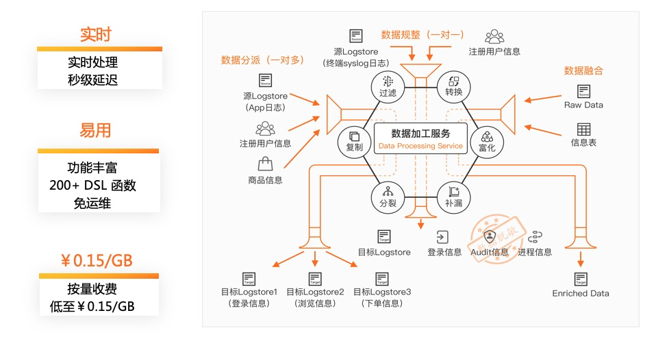
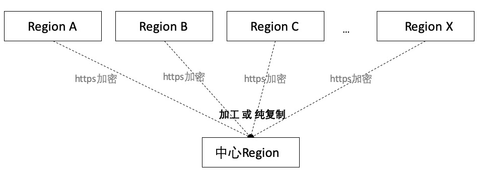
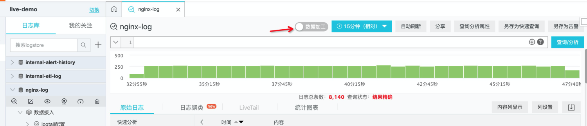
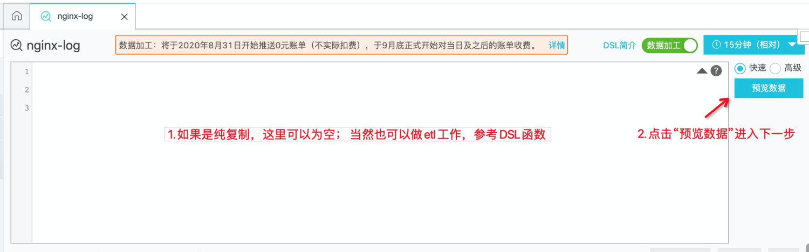
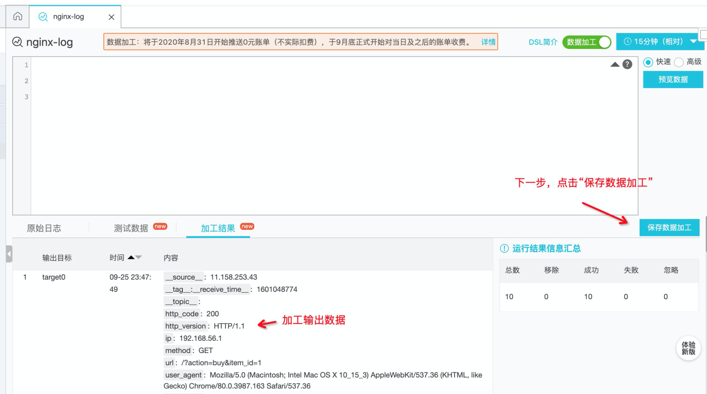
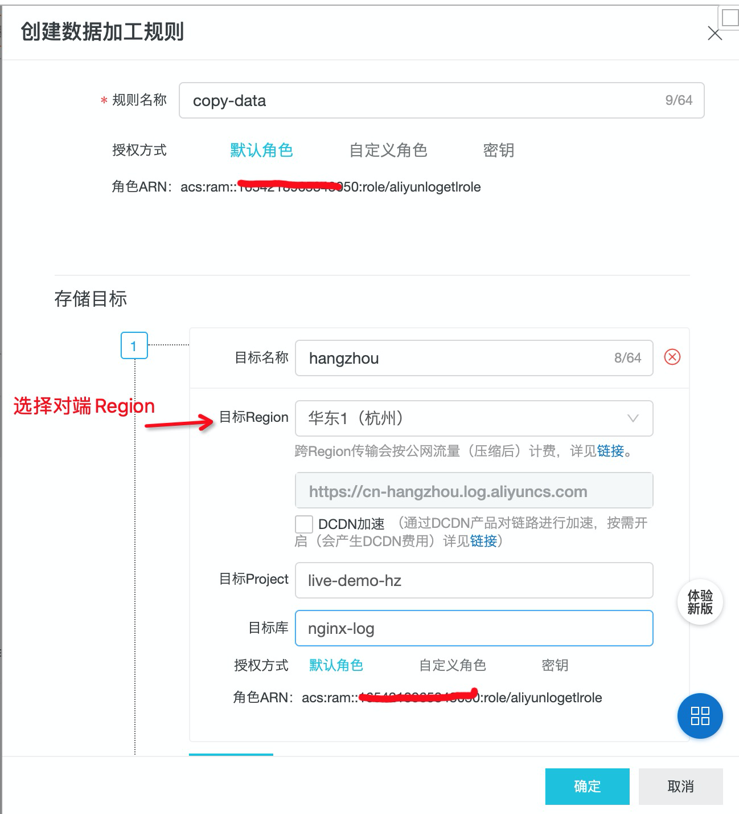
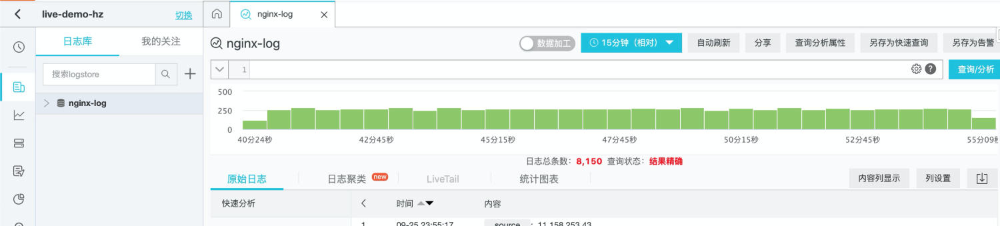
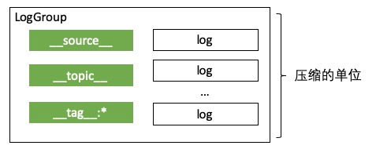
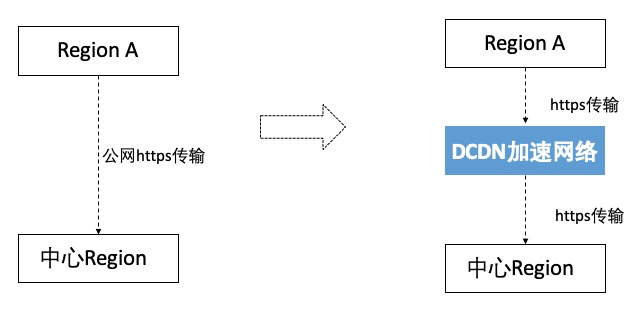
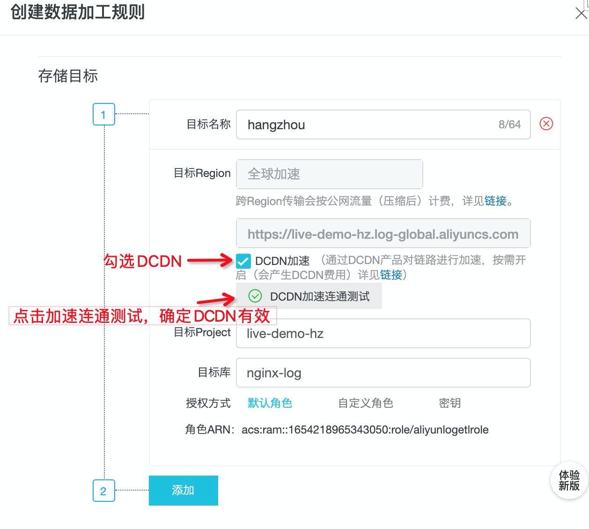

#跨Region传输功能介绍
## 数据加工

数据加工是SLS（日志服务）推出的一项功能，面向日志实时行处理，目前提供了200+的DSL算子（[链接](https://help.aliyun.com/document_detail/159702.html)）

今天给大家介绍的功能是数据加工-跨Region传输，

## 使用场景

当我们的业务分布在不同的Region，日志会分布在不同的Region，当需要对不同Region的日志进行集中管理就会遇到一定的麻烦。那么通过SLS数据加工-跨Region传输的功能，可以很好地解决这样的问题

## 跨Region传输使用方法

### Step1. 打开logstore的数据加工

### Step2. 编写DSL（如果是复制的话，DSL语句为空），编写完后，点击 预览数据进入下一步

### Step3. 保存数据加工

### Step4. 填写Output 表单， 填写目标Region

### Step 5. 点击“确定” 按钮完成数据加工任务配置

### Step 6. 检查对端logstore能否收到数据

## FAQ

### 如何收费？

1.按照传输的压缩流量计费。比如10MB的数据，如果按照1:10的压缩比，那么会产生1MB的传输流量(按这个计费)，计费参考  [链接](https://help.aliyun.com/document_detail/173043.html)

### 如何提高传输压缩率？

1.对于webtracking的场景，建议对__topic__、__tag__:* 、__source__进行处理，减少传输发送次数，提升压缩率， 原因是发送日志数据的时候，组织的单位是一个Loggroup，如果有多种__source__、__topic__、__tag__:*组合的话，会产生多个LogGroup从而降低压缩率

### 网络不稳定怎么办？

1.跨Region传输依赖公网网络环境，如果是跨境传输的话，网络稳定性不一定保证，加工作业会自动做重试

2.如果想提升传输的网络质量，可以启用DCDN加速方案

DCDN启用帮助文档：[https://help.aliyun.com/document_detail/86819.html](https://help.aliyun.com/document_detail/86819.html?spm=a2c4g.11186623.6.587.2bd06330XCteoT)

DCDN配置完成后，在创建加工任务里可以勾选“DCDN”，即可使用DCDN网络进行加速

