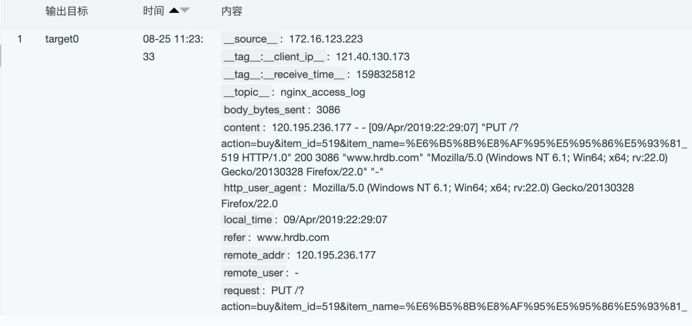
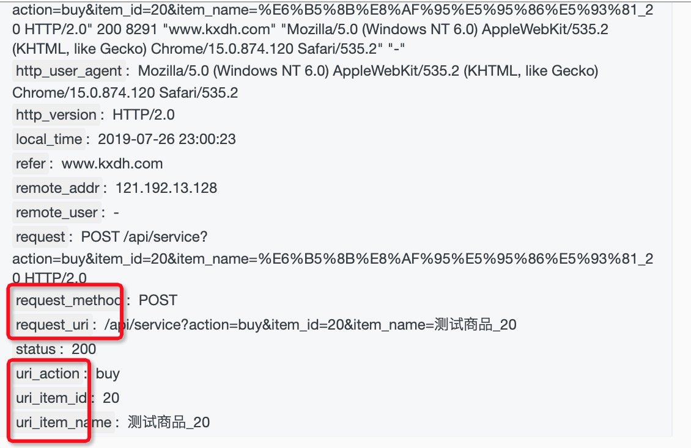
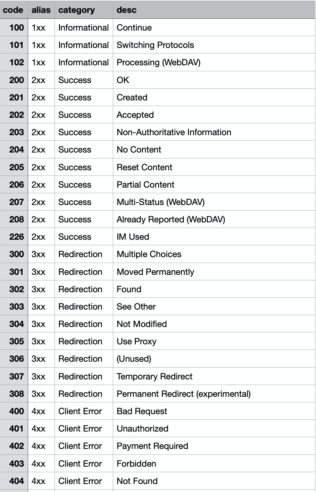
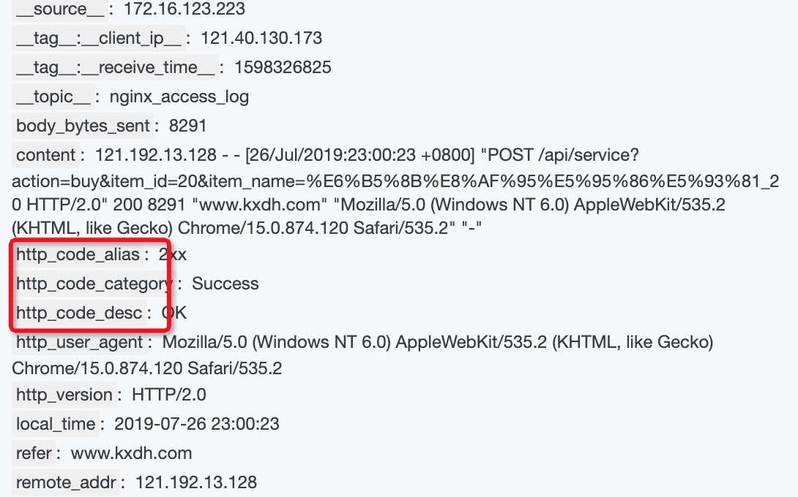
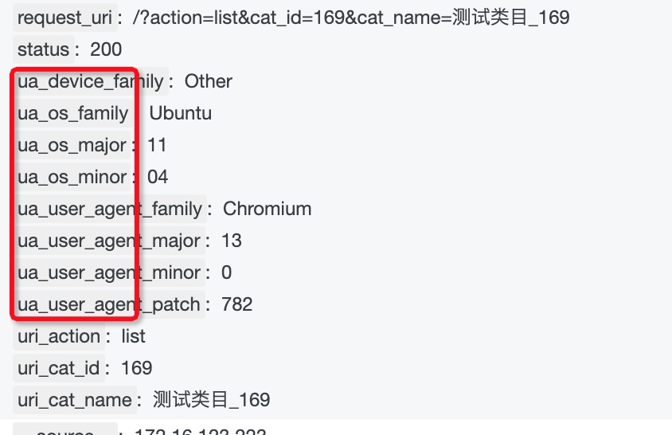
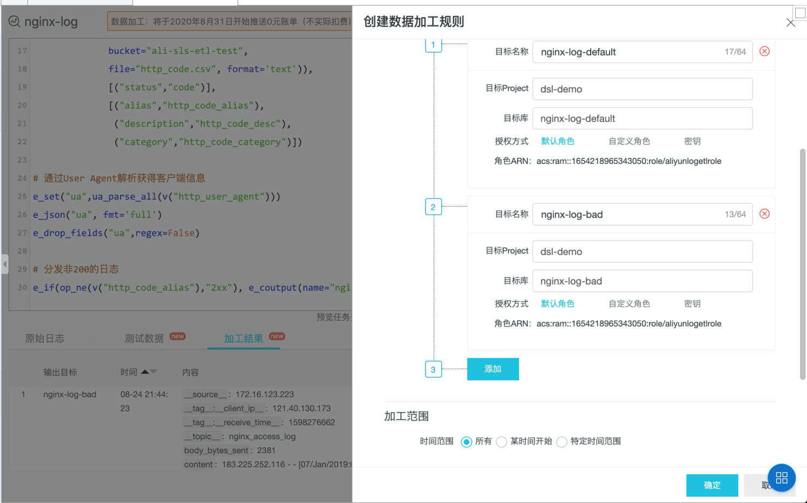

# Nginx日志解析
## Nginx原始日志

通过阿里云极简模式采集了Nginx默认日志。默认的nginx 日志format如下
```
log_format  main  '$remote_addr - $remote_user [$time_local] "$request" '
                     '$status $body_bytes_sent "$http_referer" '
                      '"$http_user_agent" "$http_x_forwarded_for"';
```
通过使用极简模式采集Nginx日志，样例如下：


## 使用正则抽取基础字段
```
# 用于将源字段里的内容，通过正则捕获组抽取出对应的字段
e_regex("源字段", "正则或有命名捕获正则", "目标字段名或数组(可选)")
```

```
# 通用字段抽取
e_regex("content",'(?<remote_addr>[0-9:\.]*) - (?<remote_user>[a-zA-Z0-9\-_]*) \[(?<local_time>[a-zA-Z0-9\/ :\-\+]*)\] "(?<request>[^"]*)" (?<status>[0-9]*) (?<body_bytes_sent>[0-9\-]*) "(?<refer>[^"]*)" "(?<http_user_agent>[^"]*)"')
```
通过正则抽取以后，可以看到日志的字段增加了refer、remote_addr、remote_user、request等字段。



## 处理时间字段
当前提取到的localtime不易读，我们把它解析成易读的格式，会用到的以下数据加工函数：

```
# 用于设置字段值
e_set("字段名", "固定值或表达式函数")

# 将时间字符串解析为日期时间对象
dt_strptime('值如v("字段名")', "格式化字符串")

# 将日期时间对象按照指定格式转换为字符串
dt_strftime(日期时间表达式, "格式化字符串")
```

实现思路，先通过 dt_strptime 将local_time的时间转化为日期时间对象，然后再通过dt_strftime将日期时间对象转化为标准的日期时间字符串。 针对Nginx local_time的转化，使用如下数据加工语句：
e_set("local_time", dt_strftime(dt_strptime(v("local_time"),"%d/%b/%Y:%H:%M:%S %z"),"%Y-%m-%d %H:%M:%S"))

```
e_set("local_time", dt_strftime(dt_strptime(v("local_time"),"%d/%b/%Y:%H:%M:%S %z"),"%Y-%m-%d %H:%M:%S"))
```

效果如下：


## 解析request uri
可以看到request字段由 METHOD URI VERSION组成，我们希望对 requst字段进行抽取，获取到请求的METHOD、URI以及VERSION，并且将请求URI中的请求的参数变成字段，方便后续进行查询。可以用以下函数来做实现

```
# 使用正则将request uri抽取
e_regex("源字段名", "正则或有命名捕获正则", "目标字段名或数组(可选)", mode="fill-auto")

# 进行urldecode
url_decoding('值如v("字段名")’)

# 设置字段值
e_set("字段名", "固定值或表达式函数", ..., mode="overwrite")

# 将request_uri中的key=value的组合抽取成字段 值的模式
e_kv("源字段正则或列表", sep="=", prefix="")
```

实现语句
```
e_regex("request", "(?<request_method>[^\s]*) (?<request_uri>[^\s]*) (?<http_version>[^\s]*)")
e_set("request_uri", url_decoding(v("request_uri")))
e_kv("request_uri", prefix="uri_")
```

实现效果



## http code状态码映射
每一个http状态码都代表了不同的含义，下面是一份http状态码的映射表， 我们可以通过e_table_map 函数来将状态码的信息扩展到我们的日志字段中，方便后续做统计分析。



涉及到的数据加工函数如下：

```
# 用来做字段富化，类似sql里join的功能
e_table_map("表格如通过tab_parse_csv(...)解析得到的",
            "源字段列表或映射列表如[('f1', 'f1_new'), ('f2', 'f2_new')]", 
            "目标字段列表")

# 用来把csv文件解析成table对象
tab_parse_csv(CSV文本数据, sep=',', quote='"')

# code的映射关系维度表是一个csv文件，存在oss上，使用res_oss_file
res_oss_file(endpoint="OSS的endpoint", ak_id="OSS的AK_ID", 
             ak_key="OSS的AK_KEY", bucket="OSS的bucket", file="在OSS中存的文件地址", 
             change_detect_interval="定时更新时间,默认为0")
```

实际使用到的DSL语句如下

```
# http状态码映射
e_table_map(
      tab_parse_csv(
           res_oss_file(endpoint="oss-cn-shanghai.aliyuncs.com",
              ak_id='',ak_key='',
              bucket="your_oss_bucket", 
              file="http_code.csv", format='text')),
              [("status","code")],
              [("alias","http_code_alias"),
               ("description","http_code_desc"),
               ("category","http_code_category")])
```

映射后的效果




## 通过UserAgent判断客户端操作系统

我们想了解客户用的是什么os版本，可以通过user agent里的字段用正则匹配来判断，用到dsl语句

```
# 取某个字段的值
v("字段名")

# 获取ua相关信息
ua_parse_all("带useragent信息的内容")

# 展开json字段, 因为ua_parse_all得到的是一个json对象，为了展开到一级字段使用e_json做展开
# 模式有 simple、full、parent、root 参考https://help.aliyun.com/document_detail/125488.html#section-o7x-7rl-2qh
e_json("源字段名", fmt="模式", sep="字段分隔符")

# 丢弃临时产生的字段
e_drop_fields("字段1", "字段2")
```

实际用到的dsl语句

```
# 通过User Agent解析获得客户端信息
e_set("ua",ua_parse_all(v("http_user_agent")))
e_json("ua", fmt='full',sep='_')
e_drop_fields("ua",regex=False)
```

加工效果



## 非200的日志投递到指定logstore

可以使用e_output函数来做日志投递，用regex_match做字段匹配
```
# 条件判断if
e_if("条件1如e_match(...)", "操作1如e_regex(...)", "条件2", "操作2", ....)

# 判断是否相等
op_ne(v("字段名1"), v("字段名2"))

# output发送到目标名称，目标名称在数据加工保存任务的时候配置对应的logstore信息
e_output(name="指定的目标名称")
```

实现语句
```
# 分发非200的日志
e_if(op_ne(v("http_code_alias"),"2xx"), e_output(name="img/nginx-log-bad"))
```

在预览里看到这个效果。（保存加工的时候，需要设置好对应project、logstore的ak信息


## 完整的DSL代码以及上线流程
好了，通过一步一步的开发调试，现得到完整的DSL代码如下

```
# 通用字段抽取
e_regex("content",'(?<remote_addr>[0-9:\.]*) - (?<remote_user>[a-zA-Z0-9\-_]*) \[(?<local_time>[a-zA-Z0-9\/ :\-]*)\] "(?<request>[^"]*)" (?<status>[0-9]*) (?<body_bytes_sent>[0-9\-]*) "(?<refer>[^"]*)" "(?<http_user_agent>[^"]*)"')

# 设置localttime
e_set("local_time", dt_strftime(dt_strptime(v("local_time"),"%d/%b/%Y:%H:%M:%S"),"%Y-%m-%d %H:%M:%S"))

# uri字段抽取
e_regex("request", "(?<request_method>[^\s]*) (?<request_uri>[^\s]*) (?<http_version>[^\s]*)")
e_set("request_uri", url_decoding(v("request_uri")))
e_kv("request_uri", prefix="uri_")

# http状态码映射
e_table_map(
      tab_parse_csv(
           res_oss_file(endpoint="oss-cn-shanghai.aliyuncs.com",
              ak_id='',ak_key='',
              bucket="ali-sls-etl-test", 
              file="http_code.csv", format='text')),
              [("status","code")],
              [("alias","http_code_alias"),
               ("description","http_code_desc"),
               ("category","http_code_category")])

# 通过User Agent解析获得客户端信息
e_set("ua",ua_parse_all(v("http_user_agent")))
e_json("ua", fmt='full',sep='_')
e_drop_fields("ua",regex=False)

# 分发非200的日志
e_if(op_ne(v("http_code_alias"),"2xx"), e_coutput(name="img/nginx-log-bad"))
```

在页面提交代码以后，保存数据加工
配置目标logstore信息，默认走完加工逻辑的日志都会发送到第一个目标logstore，我们在代码里指定了e_output到指定logstore，因此还需要第二个目标，并且目标的名字和e_output里指定的目标名称一致。




保存完即完成上线，可以在数据处理-加工下看到该任务，点击进去可以看到加工延迟等信息。


