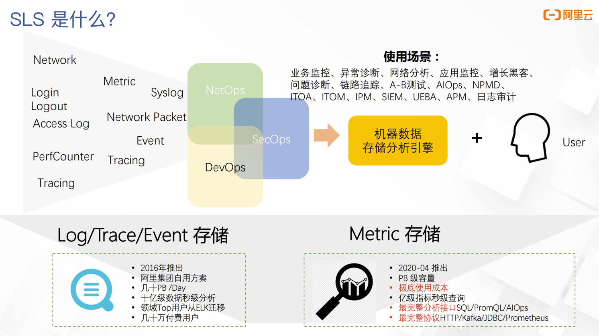
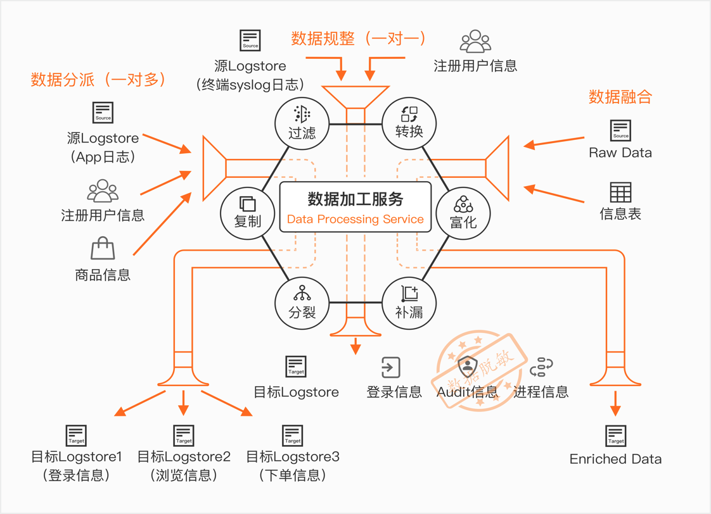
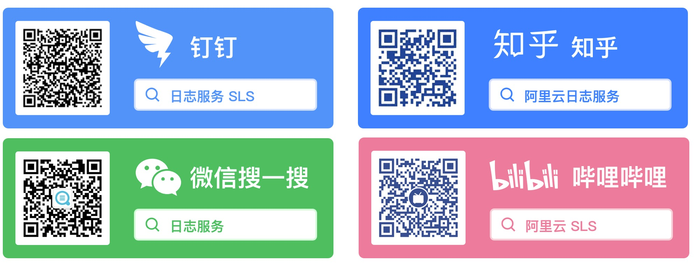

# 介绍

## 什么是SLS

日志服务（Log Service，简称SLS）是针对日志类数据的一站式服务，在阿里巴巴集团经历大量大数据场景锤炼而成。您无需开发就能快捷完成日志数据采集、消费、投递以及查询分析等功能，提升运维、运营效率，建立DT时代海量日志处理能力。

## 什么是数据加工

数据加工服务是阿里云SLS推出的面向日志ETL处理的服务，主要解决数据加工过程中转换、过滤、分发、富化等场景。

SLS数据加工DSL是专门为日志实时行处理定制的一套语言（类似Python）,本文档的目的也是让快速掌握该DSL，解决日志分析的问题

## 相关链接

* [阿里云官方SLS介绍](https://help.aliyun.com/document_detail/48869.html)
* [阿里云官方SLS数据加工介绍](https://help.aliyun.com/document_detail/125384.html)

## 联系我们

