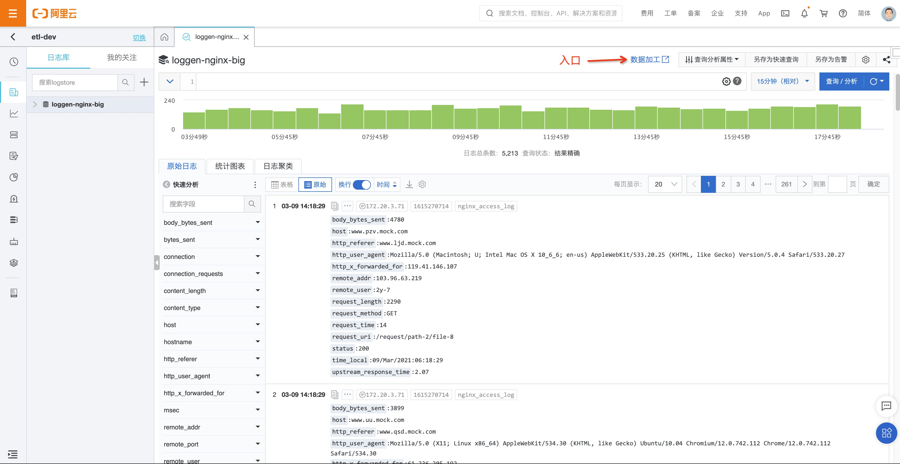
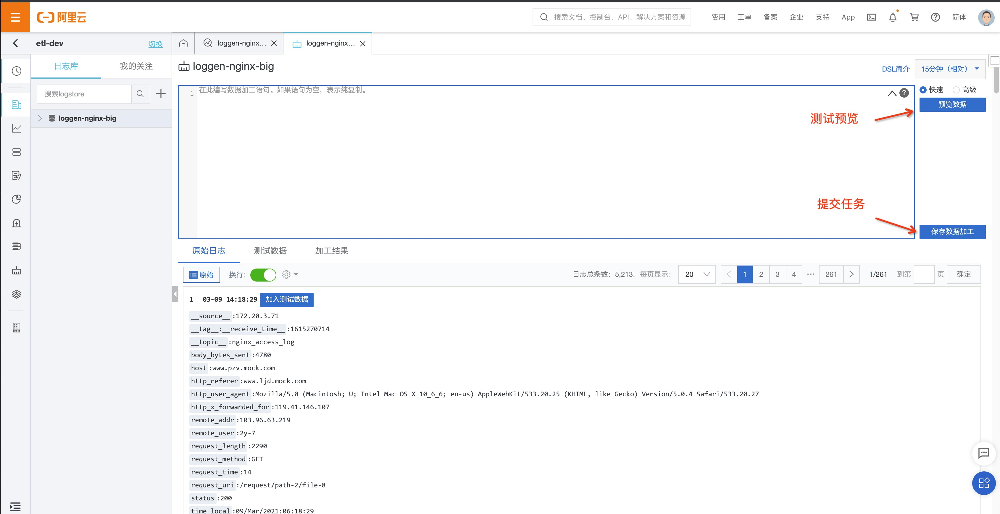
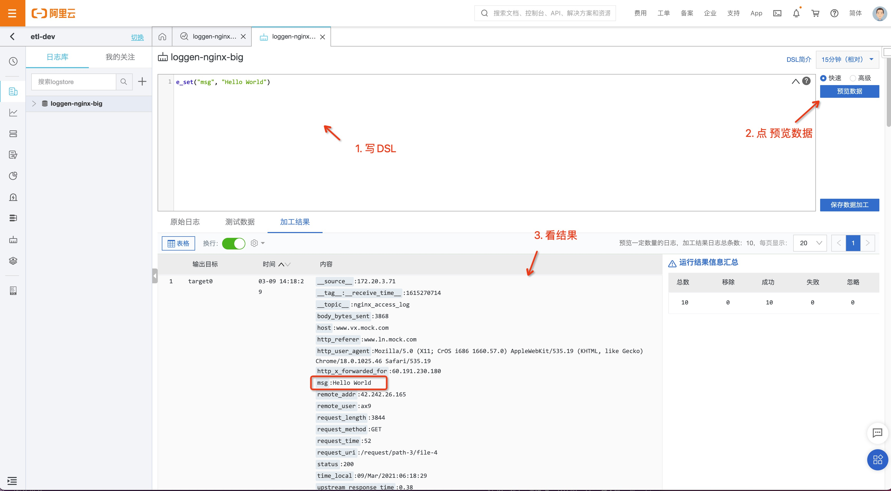
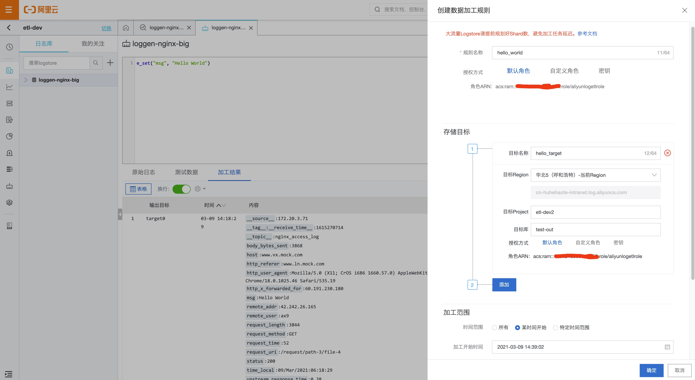

# 快速开始

## 交互界面

入口



加工开发调试入口



## Hello World

我们先实现一个最简单加工场景：向我们的日志里增加一个`msg`字段, 内容为 `Hello World`

DSL语句如下
```
e_set("msg", "Hello World")
```

看一下具体的操作和结果



## 上线加工任务

通过预览调试完成后，就可以开始上线。

上线步骤：点击界面上的“保存数据加工” 按钮，填写对应的目标Logstore的表单，即可将任务上线。上线后任务将持续运行


